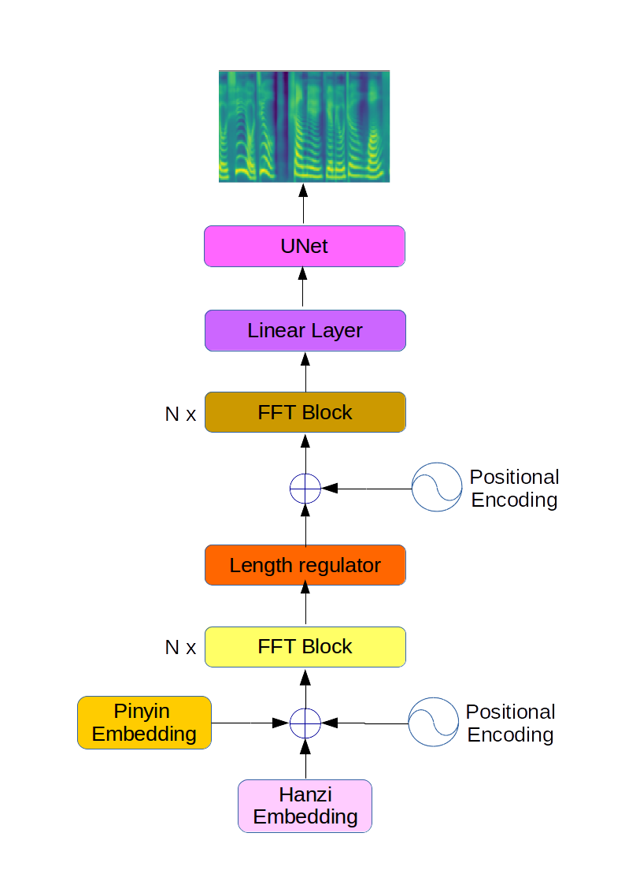
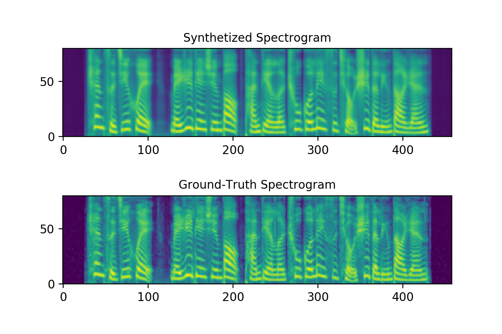
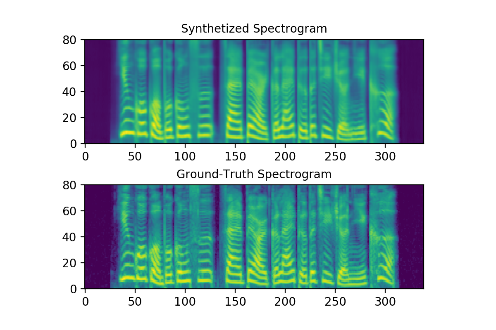
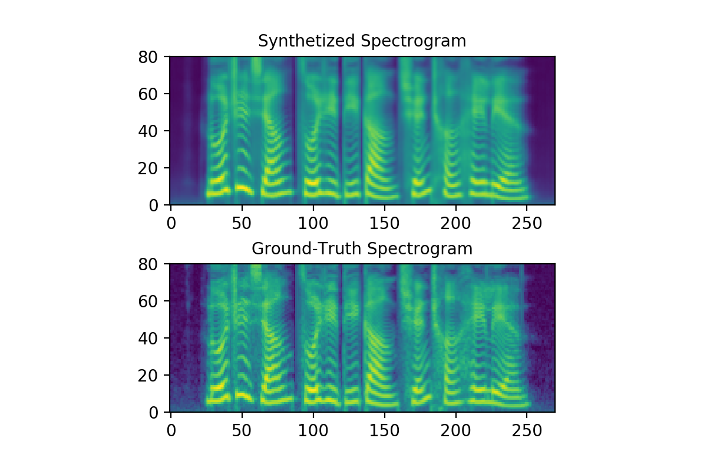

# Fastspeech 2u:  Chinese mandarin text to speech based on FastSpeech2 and Unet

This is a part-time on-going work. 建议先加星收藏，有时间我会随时更新。


This is a modification and adpation of fastspeech 2 to mandrin. The code was  originally  implemented by https://github.com/ming024/FastSpeech2. Please refer to the origin code if you want to use it for english. 

<b> Many modificaitons to the origin implmentation, including</b>: 

1. Use UNet instead postnet (1d conv). Unet is good at recovering spect details and much easier to train than original postnet
2. Added hanzi(汉字，chinese character) embedding. It's harder for human being to read pinyin, but easier to read chinese character. Also this makes it more end-to-end. 
3. Removed pitch and energy embedding, and also the corresponding prediction network. This makes its much easier to train, especially for my gtx1060 card. I will try using them back if I have time (and hardware resources)
5. Use only waveglow in synth, as it's much better tahn melgan and griffin-lim.
6. subtracted the mel-mean for (seems much) easier prediction. 
7. Changed the loss weight to  mel_postnet_loss + d_loss*0.01 + mel_loss*0.1
8. Used linear duration instead of log, and subtracted the duration_mean in training.

## Model architecture




## Dependencies

All experiments were done under ubuntu16.04 + python3.7 + torch 1.7.1. Other env probably work too.

- torch for training and inference
- librosa and ffmpeg for basic audio processing
- pypinyin用于转换汉字为拼音
- jieba 用于分词
- perf_logger用于写训练日志

To install all dependencies, run:

```
sudo apt-get install ffmpeg
pip3 install -r requirements.txt
```


## Synthesis (inference)


First clone the project and install the dependencies. 


To generate audio samples, first you need to download the checkpoint from <a href="https://drive.google.com/file/d/11mBus5gn69_KwvNec9Zy9jjTs3LgHdx3/view?usp=sharing">google drive</a> and untar it to ```mandarin_tts/```


- run the pinyin+hanzi model:

```
python synthesize.py --model_file ./ckpt/hanzi/checkpoint_300000.pth.tar --text_file ./input.txt --channel 2 --duration_control 1.0 --output_dir ./output

```

- Or you can run pinyin model:

```
python synthesize.py --model_file ./ckpt/pinyin/checkpoint_300000.pth.tar --with_hanzi 0 --text_file ./input.txt --channel 2 --duration_control 1.0 --output_dir ./output

```
More details in <a href="https://ranchlai.github.io/mandarin-tts/">this page</a>

### Audio samples

Audio samples can be found in <a href="https://ranchlai.github.io/mandarin-tts/">this page</a>


## Training

(under testing)

Currently we use baker dataset, which can be downloaded from <a href="https://www.data-baker.com/open_source.html">baker</a>

You have to comply with the data liscense before using the data. 


I have processed the data for this experiment. You can also try 
```
python3 preprocess_pinyin.py 
python3 preprocess_hanzi.py 
```
to generate required aligments, mels, vocab for pinyin and hanzi for training. Everythin should be ready under the directory './data/'(you can change the directory in hparams.py) before training. 


```
python3 train.py
```
you can monitor the log in '/home/\<user\>/.perf_logger/'

Best practice: copy the ./data folder to /dev/shm to avoid harddisk reading (if you have big enough memorry)


Some spectrograms at step 300000:






## TODO
- Add gan for better spectrogram prediction
# References
- [FastSpeech 2: Fast and High-Quality End-to-End Text to Speech](https://arxiv.org/abs/2006.04558), Y. Ren, *et al*.


