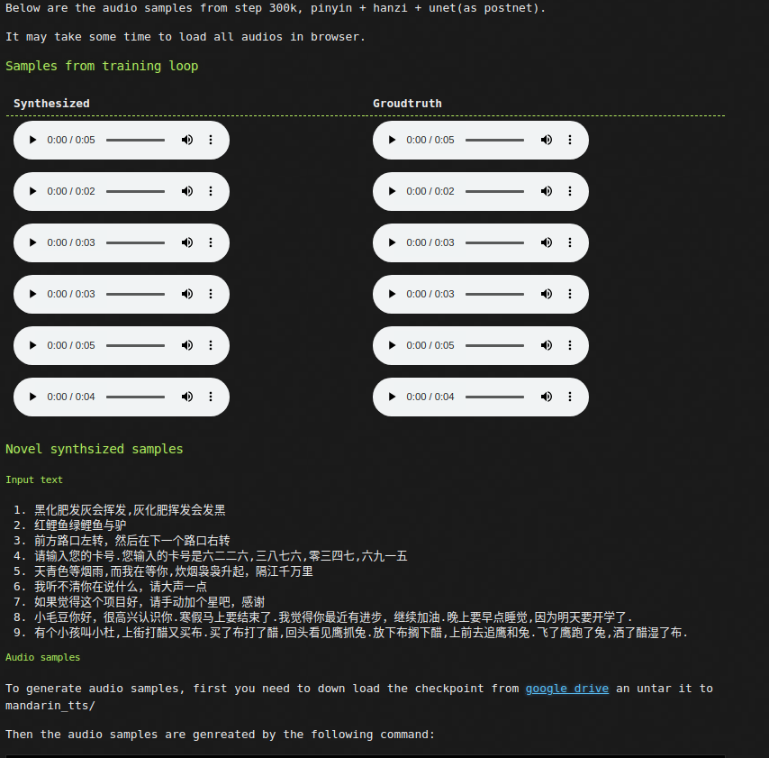

# Chinese mandarin text to speech based on Fastspeech2 and Unet

    
This is a modification and adpation of fastspeech2 to mandrin(普通话）. 
<b> Many modifications to the origin paper, including</b>: 

1. Use UNet instead of postnet (1d conv). Unet is good at recovering spect details and much easier to train than original postnet
2. Added hanzi(汉字，chinese character) embedding. It's harder for human being to read pinyin, but easier to read chinese character. Also this makes it more end-to-end. 
3. Removed pitch and energy embedding, and also the corresponding prediction network. This makes its much easier to train, especially for my gtx1060 card. I will try bringing them back if I have time (and hardware resources)
5. Use only waveglow in synth, as it's much better than melgan and griffin-lim.
6. subtracted the mel-mean for (seems much) easier prediction. 
7. Changed the loss weight to  mel_postnet_loss x 1.0 + d_loss x 0.01 + mel_loss x 0.1 
8. Used linear duration scale instead of log, and subtracted the duration_mean in training.


## Dependencies

All experiments were done under ubuntu16.04 + python3.7 + torch 1.7.1. Other env probably works too.

- torch for training and inference
- librosa and ffmpeg for basic audio processing
- pypinyin用于转换汉字为拼音
- jieba 用于分词
- perf_logger用于写训练日志

First clone the project

```
git clone https://github.com/ranchlai/mandarin-tts.git

```
If too slow, try

```
git clone https://hub.fastgit.org/ranchlai/mandarin-tts.git

```

To install all dependencies, run

```

sudo apt-get install ffmpeg
pip3 install -r requirements.txt
```


## Synthesize


```
python synthesize.py --input="您的电话余额不足，请及时充值"
```
or put all text in input.txt, then 

```
python synthesize.py --input="./input.txt"

```

Checkpoints and waveglow should be downloaded at 1st run. You will see some files in  `./checkpoint`, and `./waveglow`

In case it fails, download the checkpoint manully <a href='https://zenodo.org/record/4625672/files/checkpoint_500000.pth'>here</a>

### Audio samples

Audio samples can be found in <a href="https://ranchlai.github.io/mandarin-tts/">this page</a>




## Model architecture


## Training

(under testing)

Currently I am use baker dataset(标贝）, which can be downloaded from <a href="https://www.data-baker.com/open_source.html">baker</a>。 The dataset is for non-commercial purpose only, and so is the pretrained model. 


I have processed the data for this experiment. You can also try 
```
python3 preprocess_pinyin.py 
python3 preprocess_hanzi.py 
```
to generate required aligments, mels, vocab for pinyin and hanzi for training. Everythin should be ready under the directory './data/'(you can change the directory in hparams.py) before training. 


```
python3 train.py
```
you can monitor the log in '/home/\<user\>/.perf_logger/'

Best practice: copy the ./data folder to /dev/shm to avoid harddisk reading (if you have big enough memorry)


<b> The following are some spectrograms synthesized at step 300000 </b>


## TODO
- Clean the training code
- Add gan for better spectrogram prediction
- Add Aishell3 support


# References
- <a href="https://github.com/ming024/FastSpeech2">FastSpeech2</a>. 

- [FastSpeech 2: Fast and High-Quality End-to-End Text to Speech](https://arxiv.org/abs/2006.04558), Y. Ren, *et al*.


